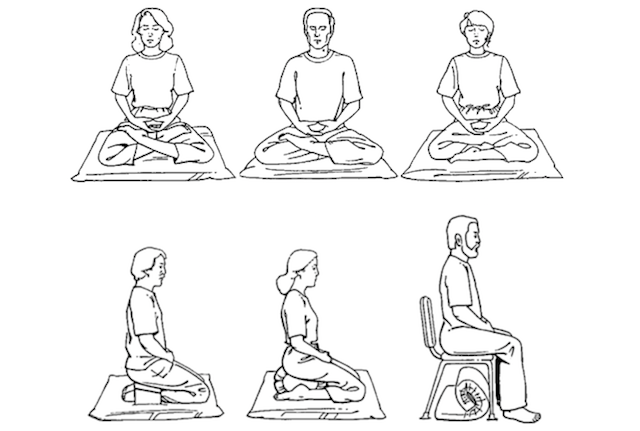

# 如何开始坐享？

太简单了，乃至于直接开始就好。

## （〇）

由于在坐享过程中，注意力足够集中的时候，全身放松的状态与人体在睡觉的状态几乎相同，所以，要注意保暖，注意风向。

> 1. 可以找个毯子盖上膝盖；
> 1. 不能有风持续吹到耳朵周围……

其中第二条尤其重要，三叉神经汇聚于耳部周围，不小心的话，可能会引起面部偏瘫。

至于姿势，其实并不重要，只要舒服就好。不一定非要盘腿…… 其实以下任何姿势都可以：

但脊背坐直倒是挺重要，因为最终，长时间弓着背可能更累。

##（一）

稍微严肃一点的话，就从以下简单的步骤开始：

> - 找个安静的地方
> - 设定一个计时器（从五分钟或者十五分钟开始，渐渐延长到四十五分钟到一小时）
> - 用你自己感觉舒服的方式坐好（最好脊背挺直）
> - 闭上眼睛
> - 开始深呼吸
> - 将自己所有的注意力全部集中到呼吸上
> - 一旦发现注意力转移到其它地方，就要刻意地将注意力集中到呼吸上
> - 持续深呼吸……

直至计时器将你“唤醒”。

##（二）

坐享几次之后，可以开始尝试在坐享过程中用你的注意力扫描你的整个身体。

从左脚的脚尖开始…… 左脚掌…… 左脚跟…… 左小腿 ……左膝盖 …… 左大腿…… 左臀…… 顺着脊柱一直到后脖跟…… 划到左肩…… 左上臂…… 左肘…… 左小臂…… 左手腕…… 左手心…… 左指尖…… 再回来…… 左手心…… 左手腕…… 左小臂…… 左肘…… 左上臂…… 左肩…… 沿着你的肩一直划到右肩…… 右上臂…… 右肘…… 右小臂…… 右手腕…… 右手心…… 右指尖…… 再回来…… 右手心…… 右手腕…… 右小臂…… 右肘…… 右上臂…… 右肩…… 回到后脖根…… 顺着脊柱一直到右臀…… 右大腿…… 右膝盖…… 右小腿…… 右脚后跟…… 右脚心…… 右脚尖……

在这个过程中，你会感觉到某个地方不舒服。这样的时候，把注意力全部集中到那个不舒服的地方，仔细观察自己的感受，尝试着接受…… 这是个机会，也是个挑战…… 一旦能做到接受那个原本不舒服的感觉，接下来的感觉竟然是解脱……

##（三）

尝试着在任何地方坐享。出租车上、火车上、飞机上、甚至颠簸的船上，或者干脆是在某个其实非常嘈杂的地方……

## 总结

总而言之，要集中注意力、并且最终可以做到自如地控制注意力才算是坐享 —— 最终的目标是可以做到在越来越长的时间里自如地注意力集中，并且还能控制集中的注意力。而胡思乱想、放空，甚至睡着了，都算不上是坐享，对增大大脑皮层面积，增厚灰质没有什么具体的帮助。

这真是一个极好的“掌握最少必要知识之后就要马上通过[践行](http://zhibimo.com/read/xiaolai/reborn-every-7-years/A02.html)进步”的好例子！